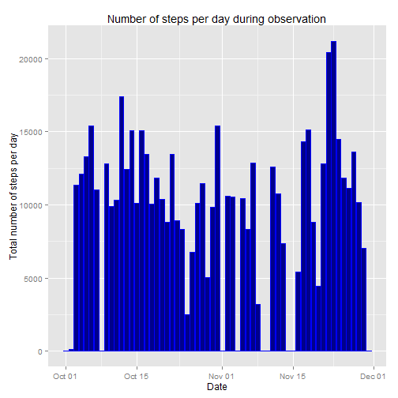
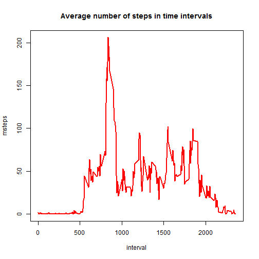
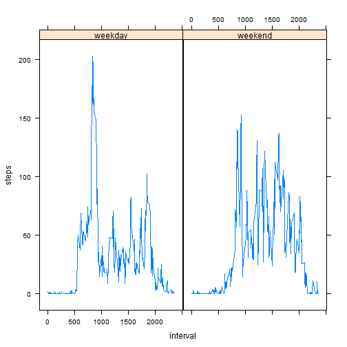

- Read the input file
- Take a quick look at the data
- Transform the Date column from factor into Date


```r
dat<-read.csv("activity.csv",header=TRUE)
head(dat)
```

```
##   steps       date interval
## 1    NA 2012-10-01        0
## 2    NA 2012-10-01        5
## 3    NA 2012-10-01       10
## 4    NA 2012-10-01       15
## 5    NA 2012-10-01       20
## 6    NA 2012-10-01       25
```

```r
dat$date<-as.Date(dat$date)
```

- sum over the number of steps in each dat using **aggregate**
- assign appropriate names to the columns
- using ggplot to plot the histogram
- print the mean and median of the number of steps per day


```r
stepsPerDay<-aggregate(dat$steps,by=list(dat$date),sum, na.rm=TRUE)
colnames(stepsPerDay)<-c("date","tsteps")
library(ggplot2)
g<-ggplot(stepsPerDay,aes(stepsPerDay$date,stepsPerDay$tsteps),xlab="Date")
g + geom_histogram(stat="identity", color="blue", fill="blue4") + xlab("Date") + ylab("Total number of steps per day") + ggtitle("Number of steps per day during observation")
```

 

```r
mean(stepsPerDay$tsteps)
```

```
## [1] 9354.23
```

```r
median(stepsPerDay$tsteps)
```

```
## [1] 10395
```

- calculate the average number of steps in each interval using aggregate
- assign appropriate names to columns
- plot the time serie
- print the time interval with maximum average steps


```r
stepsTroughDay<-aggregate(dat$steps,by=list(dat$interval),mean, na.rm=TRUE)
colnames(stepsTroughDay)<-c("interval","msteps")
plot(stepsTroughDay,type="l",col="red",lwd=2, main="Average number of steps in time intervals")
```

 

```r
stepsTroughDay$interval[which.max(stepsTroughDay$msteps)]
```

```
## [1] 835
```

- Total number of "NA"
- "NA" are replaced by total number of steps of that day * mean of the interval / average of steps per dat and stored in a data frame called nadat
- Histogram, mean, and median of the new data frame are printed.


```r
sum(is.na(dat$steps))
```

```
## [1] 2304
```

```r
nadat<-dat
for (i in 1:17568){
  if (is.na(dat$steps[i])){
    nadate<-dat$date[i]
    nainterval<-dat$interval[i]
    spd<-subset(stepsPerDay,stepsPerDay$date==nadate)
    std<-subset(stepsTroughDay,stepsTroughDay$interval==nainterval)
    nadat$steps[i]<-spd$tsteps/mean(stepsPerDay$tsteps)*std$msteps
  }
}
nastepsPerDay<-aggregate(nadat$steps,by=list(nadat$date),sum)
colnames(nastepsPerDay)<-c("date","tsteps")
g<-ggplot(nastepsPerDay,aes(nastepsPerDay$date,nastepsPerDay$tsteps),xlab="Date")
g + geom_histogram(stat="identity", color="blue", fill="blue4") + xlab("Date") + ylab("Total number of steps per day") + ggtitle("Number of steps per day during observation")
```

 

```r
mean(nastepsPerDay$tsteps)
```

```
## [1] 9354.23
```

```r
median(nastepsPerDay$tsteps)
```

```
## [1] 10395
```
Mean and median do not change because the imputation is chosen using the
mean of the steps per day and steps in intervals.

- Attribute the factor **week** to the days of nadat
- calculating the average number of steps with respect to **interval** and
**week**
- plotting the means


```r
dayType <- function(dates) {
  typ <- function(date) {
    if (weekdays(date) %in% c("Saturday", "Sunday")) {
      "weekend"
    }
    else {
      "weekday"
    }
  }
  sapply(dates, typ)
}

nadat$week <- as.factor(dayType(nadat$date))
stepsThrouhDayWeek<-aggregate(steps~interval+week,nadat,mean)
library(lattice)
xyplot(steps ~ interval | week, data=stepsThrouhDayWeek, layout=c(2,1), type='l',lwd=1.5)
```

 
